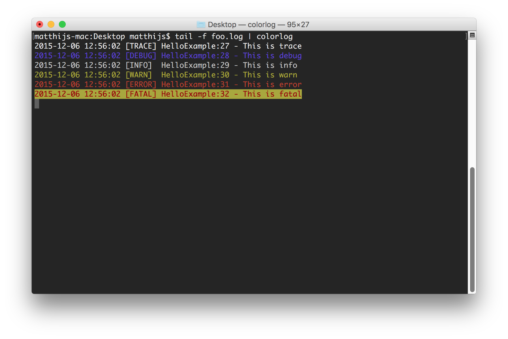

## Colorlog
Simple utility to colorize typical logging output using ANSI escape codes. The functionality is inspired by the
GrepConsole plugin for Eclipse and IDEA. In contrast to those plugins, this program is intended to use in a terminal window.

## Logging format
Input is read from <tt>stdin</tt> and analyzed line-by-line for the following 'log level' tags:
- TRACE
- DEBUG
- INFO
- WARN
- ERROR
- FATAL

Depending on the log level, output is colorized as follows:
- TRACE -> default
- DEBUG -> blue text
- INFO  -> white text
- WARN  -> yellow text
- ERROR -> red text
- FATAL -> red text, yellow background

## Usage
Suppose we have a file called <tt>foo.log</tt> to which our program is actively writing logging information,
one could use the <tt>tail</tt> program, piped through the <tt>colorlog</tt> program to follow the logging output:
<tt>$ tail -f foo.log | colorlog</tt>

